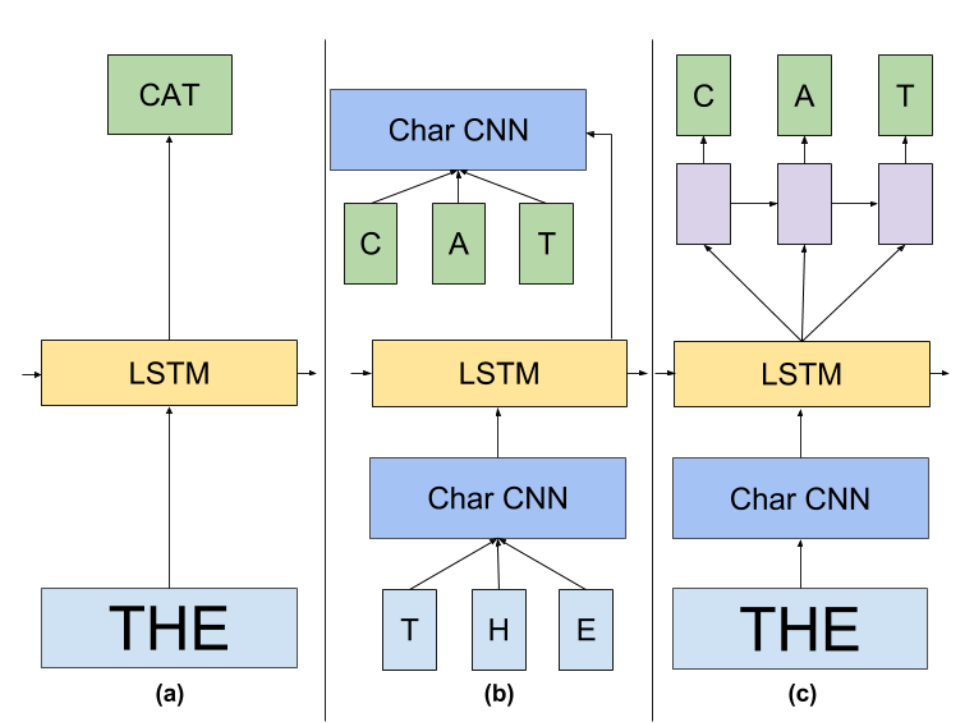

# ELMo

### ELMo\(Embedding from Language Model\)

RNN-based language models\(trained from lots of sentences\)

模型训练完得到contextualized word embedding.

思想是先预训练好，然后fine-tune 三个模型框架整合，输入和输出层都是CNN模型，不过该CNN的输入粒度是字符。中间是由Bi-LSTM组成的。

ELMo有很多层，每层都会生成word embedding

**神经网络结构:**

ELMo的每一层都会包含left-to-right的embedding输出和right-to-left的embedding输出，作为整一层的输出，需要对两个输出进行加权求和，这个权重W是根据我们的下游任务训练更新的。

