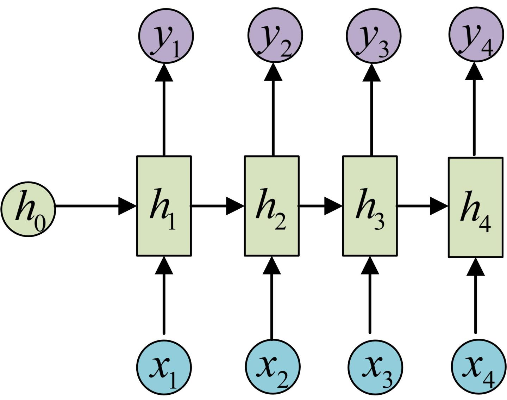
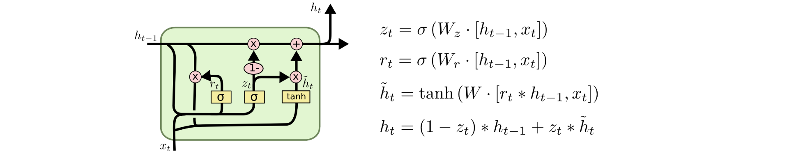

# RNN&LSTM&GRU

### RNN \(Recurrent Neural Network 循环神经网络\)

RNN是一种特殊的神经网络，2010年基于”人的认知是基于过往的经验和记忆“这一观点提出的。RNN之所以叫循环神经网络，是因为一个序列当前的输出跟前面的输出有关。具体的表现形式为网络会对前面的信息进行记忆并应用于当前输出的计算中，即隐藏层之间的节点不再无连接而是有连接的，并且隐藏层的输入不仅包括输入层的输出还包括上一时刻隐藏层的输出。

RNN有三个权重矩阵，分别是:

* 从Input layer到Hidden layer的权重矩阵U
* 从t-1时刻的Hidden layer状态结点到t时刻状态结点的权重矩阵W
* 从Hidden layer到Output layer的权重矩阵V

**这三个权重矩阵在任何时刻都是参数共享的。**

#### RNN的网络结构

#### FFNN\(Feed-Forward Neural Network\)：

$$Hidden layer: h_t = F(W*h_{t-1}+U*x_1)$$

 $$Output layer: y_t = G(h_t)$$

一般来说，F\(\)函数一般是激活函数，可以为sigmoid，也可以是ReLu等。G\(\)函数为加权求和或Softmax函数等。

> 此外，RNN的输出可以为1个，也可以为多个。当输入为M时，输出可以为1，可以为M，也可以为N\(N不等于M\)。

#### BPTT\(Back Propagation Through Time\):

因为每一个Output layer和Hidden layer都与该结点的前一个结点有关，所以通过BP仅对当前时间t进行梯度下降是不行的。

推导tips:导数乘法。

**TO-DO：补充BPTT计算推导**

优点:计算长时间序列的效果不错

缺点:由于BP和长时间记忆的问题，会出现梯度消失或者梯度爆炸。

_Reference-《深度学习之RNN\(循环神经网络\)》:_[https://blog.csdn.net/qq\_32241189/article/details/80461635](https://blog.csdn.net/qq_32241189/article/details/80461635)

作为RNN的改进，引入了两种门控技术,为LSTM和GRU。

* 对于梯度消失:由于它们都有特殊的方式存储”记忆”，那么以前梯度比较大的”记忆”不会像简单的RNN一样马上被抹除，因此可以一定程度上克服梯度消失问题。
* 对于梯度爆炸:用来克服梯度爆炸的问题就是gradient clipping，也就是当你计算的梯度超过阈值c或者小于阈值-c的时候，便把此时的梯度设置成c或-c。

### LSTM\(Long Short Term Memory Network 长短时记忆网络\)

LSTM相比传统的RNN，多了一个隐藏状态，用来保存长期的状态信息，称为**单元状态Cell state**。

那么怎么去控制这个Cell去保存的信息呢？LSTM用“门”这个概念去操控的。

LSTM有三个门，总共包含了六个计算步骤，每一个门简单的来讲就是一个全连接层，通过激活函数sigmoid之后，输出一个0-1之间的实数。

#### LSTM的网络结构：

> $$[h_{t-1},x_t]$$这个表示将两个向量拼接。

#### 遗忘门 forget gate:

遗忘门决定了上一时刻的单元状态有多少保留到当前时刻

$$F_t = σ(W_f*[h_{t-1},x_t]+b_f)$$

#### 输入门 input

输入门决定了当前时刻有多少信息保存到单元状态

$$i_t = σ(W_i*[h_{t-1},x_t]+b_i)$$

$$C_t^~ = tanh(W_C*[h_{t-1},x_t]+b_C)$$                 注意，这里采用tanh是为了生成一个新的Cell state

$$C_t = f_t*C_{t-1}+i_t*C_t~$$

#### 输出门 output

输出门控制单元状态有多少信息输出到隐藏状态

$$o_t = σ(W_o*[h_{t-1},x_t]+b_o)$$

$$h_t = tanh(C_t)*o_t$$                                          注意，这里采用tanh也是为了生成一个新的Hidden state

LSTM的本质还是一个RNN，所以我们依然可以通过BPTT去进行优化。

#### Bi-LSTM

另外，LSTM本身是一个left-to-right的语言模型，考虑到长句前后语义情况，提出了**Bi-LSTM**，由两个LSTM神经网络组成，一个负责left-to-right，另一个负责right-to-left，最后输出的隐状态拼接在一起后计算概率分布，然后输出。

_Reference-《详解LSTM》:_[https://www.jianshu.com/p/dcec3f07d3b5](https://www.jianshu.com/p/dcec3f07d3b5) 

_Reference-Colah- 《Understanding LSTM Networks》:_ [http://colah.github.io/posts/2015-08-Understanding-LSTMs/](http://colah.github.io/posts/2015-08-Understanding-LSTMs/)

### GRU\(Gate Recurrent Unit \)

GRU 和 LSTM 一样，都是RNN的优化改良版本，但是与LSTM不同的是，GRU中只用了两个门，分别是更新门\(update gate\)和重置门\(reset gate\)，而且计算开销比LSTM小很多（贫穷限制了我！）

**更新门​:**用于控制前一时刻的状态信息被带入到当前状态中的程度，更新门的值越大说明前一时刻的状态信息带入越多。

**重置门​:**控制前一状态有多少信息被写入到当前的候选集 ​上，重置门越小，前一状态的信息被写入的越少

当前时刻的​用tanh是将当前时刻的信息缩放到\[-1,1\]

