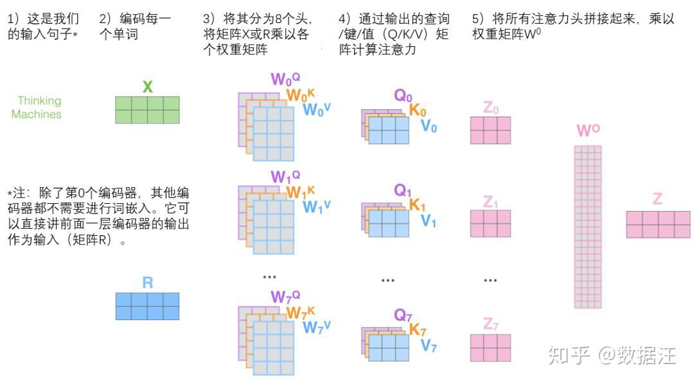

# Seq2Seq & Attention & Transformer

### Seq2Seq

用传统的RNN或者LSTM等语言模型处理机器翻译等工程时，会出现一个问题，就是当输入输出不等长时的映射关系，为了解决这个问题，提出了Encoder-Decoder框架思想，Seq2Seq就是Encoder-Decoder架构中最出名的模型。

**结构:**将两个RNN模型（或者是其他语言模型）拼接起来，一个作为Encoder，最终输出一个**语义向量C**，并且将这个语义向量C当做Decoder中的Hidden layer的初始状态输入。另一个Decoder接收原本的词向量，结合接收到的语义向量，输出目标。

> 关注的问题通常是输入数量为m，输出数量为n，m不等于n的情况。

#### Seq2Seq的网络结构

#### EXAMPLE

> INPUT:
>
> OUTPUT:
>
> 语义编码C=F\(x\_1,x\_2,x\_3,...,x\_m\)
>
> y\_i = G\(C,y\_1,y\_2,...,y\_i-1\)
>
> _注：F\(\)一般为激活函数，G\(\)一般为加权求和。_

从上面的例子可知，不管生成哪个单词，语义向量C都是一样的，对任何时间步来说并无区别。

所以在文本输入句子长度较短时，问题不大；当句子长度较长时，则会丢失中间单词的语义信息。

### Attention Mechanism 注意力机制

目前大多数注意力模型附着于Encoder-Decoder框架下，核心目标是从众多信息中选择出对当前任务目标更关键的信息。

不同于Seq2Seq结构，在注意力模型中，在任何时刻会分配给不同模型的注意力值大小，即概率分布。

原本的语义向量C变成根据当前生成的单词不断变化的$C\_i$

#### EXAMPLE

> $INPUT:$
>
> $OUTPUT:$
>
> $y\_i = G\(C\_i,y\_1,y\_2,...,y\_i-1\)$
>
> _注：F\(\)一般为激活函数，G\(\)一般为加权求和。_

\_\_$$C_i$$的计算公式为: $$Ci = \sum_{j=1}^{Lx}a_{i,j} h_j$$

> $L\_x$ 是句子Source的长度，a\_{i,j}$$表示输出第 i 个单词时，第 j 个单词的注意力分配系数，$h\_j$是在Encoder中 j 时刻隐层向量.

Attention值计算步骤：

1. 分别通过三个权重矩阵，将词向量生成key和value，query
2. 计算query和key的相似度（点积、cosine等）
3. 对相似度通过Softmax进行归一化变成权重系数，也就是$C_i$计算公式里的$a_{i,j}$
4. 对权重系数和value的值进行加权求和

_Reference-张俊林-《深度学习中的注意力机制》:_[https://zhuanlan.zhihu.com/p/37601161](https://zhuanlan.zhihu.com/p/37601161)

### 

### Transformer

最核心的机制就是self-attention,与传统的attention机制不同，传统的attention机制关心的是输入和输出的序列之间联系，而self-attention更关注的是序列内部词语之间的联系。

#### self-attention 自注意力

自注意力层就是特殊的注意力层， **关注序列内部词语的联系和顺序**。计算过程与注意力层一致，不过query为Source的token。

#### multi-headed attention 多头注意力机制

* 扩展了模型专注不同位置的能力
* 提供注意力层的多个“表示子空间”（也就是会生成多个不同的Q,K,V）

1. 首先将词向量分别与 $$W_K,W_V,W_Q$$ 权重矩阵相乘n次（论文里是8次），然后会生成n个注意力头
2. 接下来将这n个注意力头左右拼接在一起（首尾相连）
3. 接着再乘以一个附加的权重矩阵 $$W_z$$ ，得到一个融合所有注意力头的矩阵z，并送入下一层的FFNN中。

#### 输入-字符位置编码

为了让模型理解单词的顺序，我们添加了位置编码向量，这些向量的值遵循特定的模式。

在论文中，位置编码的生成是**由词向量的左半边通过一个正弦函数，右半边通过一个余弦函数，之后将两个输出向量拼接到一起，生成了位置编码。**

所以我们输入模型不再是一个简单的词向量，而是以**词向量+字符位置编码**作为输入。

#### add-Norm 层

在Transformer中，Encoder和Decoder都有Add-Norm层，分别在self-attention层与FFNN层之后，这个层的左右就是用来作残差相加。即把输入的词向量 x 和通过self-attention层的输出向量$z\_0$相加，然后做一个归一化处理生成向量  $$z_1$$ 。之后将 $$z_1$$ 和 $$z_1$$ 通过FFNN后的输出向量相加，再做一个归一化处理。

_Reference-《BERT大火却不懂Transformer？读这一篇就够了》:_[https://zhuanlan.zhihu.com/p/54356280?utm\_source=wechat\_session&utm\_medium=social&utm\_oi=851764705579110400](https://zhuanlan.zhihu.com/p/54356280?utm_source=wechat_session&utm_medium=social&utm_oi=851764705579110400)

#### fine-tuning 微调技巧

1. discriminative fine-tuning,
2. slanted triangular learning rates
3. gradual unfreezing

